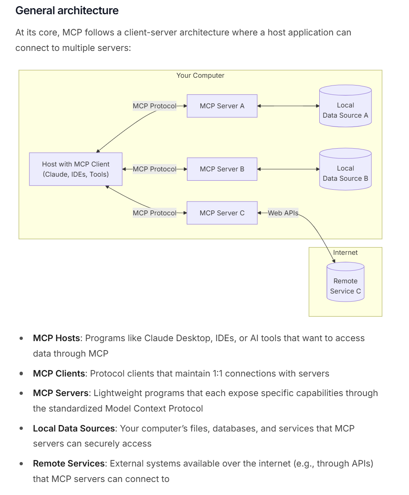
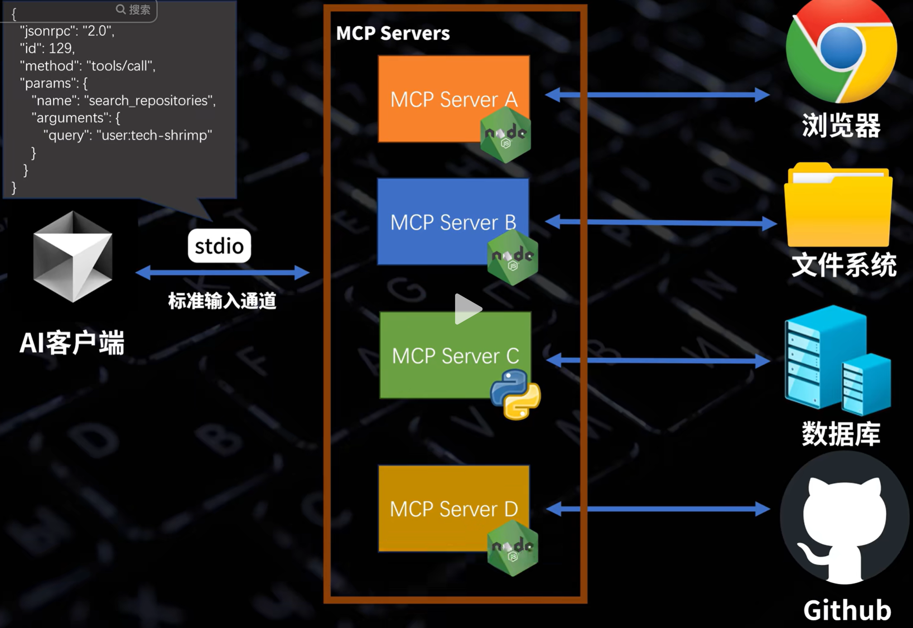
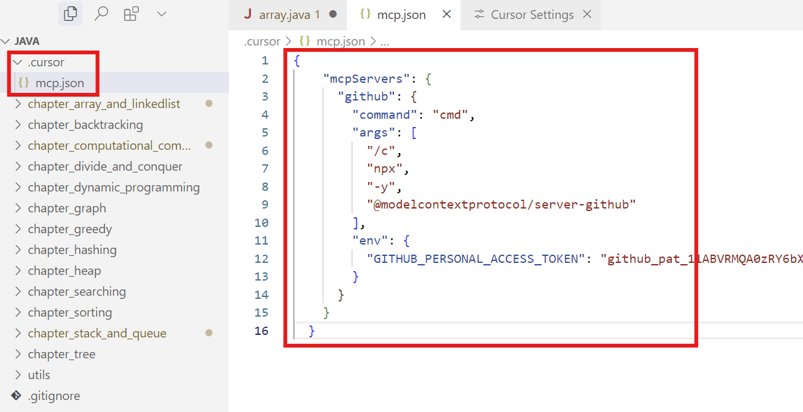
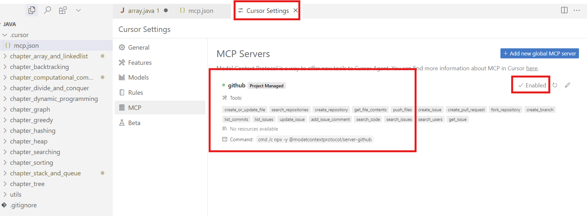
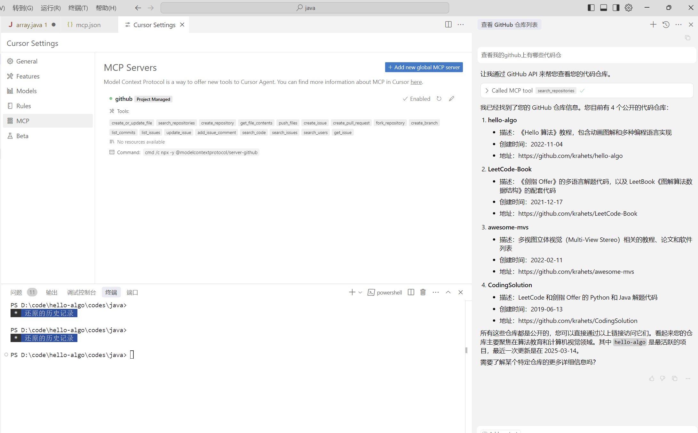
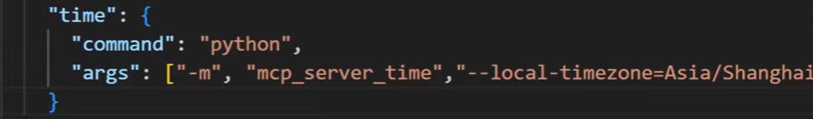

# MCP完全指南：从Function Calling到API标准化

## 前言
要理解MCP（Model Context Protocol），我们需要从它要解决的问题和演化路径说起。本文将系统地介绍MCP的来龙去脉、工作原理和实践应用。

## 一、从Function Calling说起

### 1.1 大模型的局限
大模型本质上是一个文本输入输出系统（当然也支持图片、音频、视频），但要实现与外部世界的交互，还需要额外的机制支持。这种局限性主要体现在：

1. 无法直接调用外部API和服务
2. 缺乏对结构化数据的处理能力
3. 无法持久化存储和管理状态
4. 难以进行复杂的工具链集成

### 1.2 Function Calling的诞生
OpenAI首创的Function Calling机制，让我们以获取天气信息为例，看看其工作流程：

1. 开发者需要手动实现天气查询函数
   ```python
   def get_weather(city):
       # 需要自行处理API密钥管理
       api_key = "your_api_key"
       url = f"https://api.openweathermap.org/data/2.5/weather?q={city}&appid={api_key}"
       response = requests.get(url)
       return response.json()
   ```

2. 按规定格式提供函数描述
   ```json
   {
     "name": "get_weather",
     "description": "获取指定城市的天气信息",
     "parameters": {
       "type": "object",
       "properties": {
         "city": {
           "type": "string",
           "description": "城市名称"
         }
       },
       "required": ["city"]
     }
   }
   ```

3. 模型处理函数描述并生成调用指令
   - 大模型接收用户输入和函数描述
      用户："帮我查看北京的天气"
      模型：分析用户意图，确定需要调用天气查询函数

   - 大模型进行参数解析和验证
      - 从用户输入中提取城市信息（"北京"）
      - 验证参数是否符合函数描述中的要求
      - 确保必填参数（city）已提供

   - 大模型生成标准化的JSON响应，描述要调用的函数和参数
      ```json
      {
        "name": "get_weather",
        "arguments": {
          "city": "北京"
        }
      }
      ```

4. 应用程序处理模型响应
   a. 解析模型返回的JSON格式
   b. 提取函数名和参数信息
   c. 调用对应的函数实现
   d. 处理可能的错误情况

5. 函数执行结果返回给模型
   ```json
   {
     "temperature": 298.15,
     "description": "晴朗"
   }
   ```

6. 模型根据返回结果生成用户友好的回答
   "北京现在天气晴朗，温度25℃（已从开尔文转换）。"

### 1.3 Function Calling的不足
继续以天气查询为例，使用Function Calling时开发者需要处理以下繁琐工作：

1. **手动管理API集成**
   - 自行处理API密钥的存储和管理
   - 实现错误处理和重试机制
   - 处理API响应格式转换
   ```python
   def get_weather(city):
       try:
           api_key = os.getenv("WEATHER_API_KEY")
           if not api_key:
               raise ValueError("Missing API key")
           
           url = f"https://api.openweathermap.org/data/2.5/weather?q={city}&appid={api_key}"
           response = requests.get(url)
           response.raise_for_status()
           
           data = response.json()
           return {
               "temperature": data["main"]["temp"],
               "description": data["weather"][0]["description"]
           }
       except requests.exceptions.RequestException as e:
           return {"error": f"API request failed: {str(e)}"}
       except Exception as e:
           return {"error": f"Unexpected error: {str(e)}"}
   ```

2. **繁琐的函数描述转换**
   ```json
   {
     "name": "get_weather",
     "description": "获取城市天气信息",
     "parameters": {
       "type": "object",
       "properties": {
         "city": {
           "type": "string",
           "description": "城市名称"
         }
       },
       "required": ["city"]
     },
     "returns": {
       "type": "object",
       "properties": {
         "temperature": {
           "type": "number",
           "description": "温度（开尔文）"
         },
         "description": {
           "type": "string",
           "description": "天气描述"
         }
       }
     }
   }
   ```

这个过程存在多个问题：
1. **安全性**：缺乏统一的认证和权限管理，API密钥暴露风险高
2. **可维护性**：函数定义和实现分散，每个API都需要单独维护
3. **扩展性**：添加新API或更新现有API都需要大量重复工作
4. **标准化**：缺乏统一的错误处理和返回格式规范
5. **开发效率**：需要手动处理API调用、参数验证、错误处理等基础工作

## 二、MCP的价值与原理

### 2.1 MCP的核心价值

MCP要解决的核心问题是API调用的标准化，具体体现在：

1. 标准化Function Calling
   - 提供统一的客户端和服务端SDK
   - 简化API集成流程
   - 统一的认证和权限管理
   - 自动化的函数描述生成

2. 统一API接入标准
   - 所有API都可以通过MCP方式暴露
   - 实现API的标准化调用
   - 降低API集成的复杂度

3. 增强开发效率
   - 减少重复性工作
   - 自动化API信息管理
   - 简化错误处理流程

### 2.2 MCP的工作原理

MCP的工作原理可以从以下几个方面来理解：

1. 架构设计
   - MCP主机：使用LLM并需要访问外部数据的程序
   - MCP客户端：负责与服务器通信的协议客户端
   - MCP服务器：暴露功能的轻量级程序
   - 本地数据源：可被安全访问的本地文件或数据库
   - 远程服务：可通过网络访问的外部系统

2. 功能组件
   - 资源（Resources）：提供只读数据，类似GET端点
   - 工具（Tools）：执行操作，类似POST端点
   - 提示（Prompts）：定义LLM交互模板

3. 工作流程
   - API提供方通过MCP服务器暴露API
   - 客户端应用通过MCP SDK获取API信息
   - 应用将API信息组织后发送给大模型
   - 大模型返回标准格式的调用指令
   - 应用通过SDK执行相应的API调用

### 2.3 使用MCP实现天气查询示例

让我们用MCP重新实现前面的天气查询功能，看看流程如何简化：

1. 使用MCP SDK快速创建服务器
   ```python
   from mcp import MCPServer, resource
   
   server = MCPServer()
   
   @resource("weather://{city}")
   async def get_weather(city: str):
       # MCP自动处理API密钥管理和错误处理
       return await server.weather_api.get_weather(city)
   
   server.start()
   ```

2. MCP自动生成标准化的函数描述
   - 无需手动编写JSON描述
   - 自动从Python类型注解生成参数信息
   - 统一的错误处理和返回格式

3. 客户端集成流程
   有了MCP server后，在AI应用（比如IDE插件、AI助手、cursor、cline）中，可通过MCP客户端sdk访问服务端的资源和工具
   
   下面是一个完整的客户端集成示例：
   ```python
   from mcp import MCPClient
   
   # 1. 初始化MCP客户端
   client = MCPClient()
   
   # 2. 连接到MCP服务器
   # weather_server是在MCP服务器启动时配置的服务器标识
   client.connect("weather_server")
   
   # 3. AI应用调用服务器资源
   # 使用URI格式访问资源：protocol://parameters
   # weather://是协议名，beijing是参数
   response = await client.call("weather://beijing")
   
   # 4. 处理标准化的返回结果
   # response是一个包含天气信息的字典
   print(f"北京天气：{response['description']}，温度：{response['temperature']}")
   ```

   集成要点说明：
   - **URI格式**：MCP使用URI格式定义资源访问路径，如`weather://{city}`
   - **类型安全**：参数和返回值都有类型检查，避免运行时错误
   - **异步支持**：默认支持异步操作，提高性能
   - **错误处理**：统一的错误处理机制，包含重试和超时处理

4. 核心改进
   - **简化开发**：从几十行代码简化到几行代码
   - **自动化管理**：API密钥和认证由MCP统一处理
   - **标准化处理**：错误处理和重试机制统一封装
   - **类型安全**：自动的参数验证和类型检查
   - **即插即用**：支持快速更换或添加新的API提供商

通过这个对比示例，我们可以清楚地看到MCP在简化开发流程、提高代码质量和增强可维护性等方面带来的显著改进。

### 2.4 MCP的架构
MCP的架构如下图所示：


来源：https://modelcontextprotocol.io/introduction


形象一点，我们可以这么来看, 其中mcp server一般是nodejs或者python实现的服务侧代码




### 2.5 与Function Calling的关系

MCP是对Function Calling机制的进一步标准化和扩展：

1. Function Calling的局限
   - 仅提供函数调用的基本标准
   - 需要手动实现函数定义和调用逻辑
   - 缺乏统一的认证和权限管理
   - API集成过程繁琐

2. MCP的优势
   - 提供完整的API标准化方案
   - 简化API的接入和调用流程
   - 统一的SDK支持多种编程语言
   - 自动化的API信息管理

3. 实际应用场景
   - 开发者可以快速接入第三方API
   - 支持本地和远程服务的统一管理
   - 便于构建可扩展的AI应用

### 2.6 cursor里面实操MCP

#### 1. 首先在代码工程下面创建.cursor目录，然后在cursor目录下创建mcp配置文件mcp.json

#### 2. 在json文件中配置相应的mcpserver配置，这里我配置的是github的server，目前业界已经有很多公开的mcpserver了，大家可以去github官方的server库选择需要的https://github.com/modelcontextprotocol/servers， 这里我选择了github的mcpserver，主要用来操作github代码库。



#### 3. 配置好后，打开cursor的setting，选择mcp，enable 刚才配置好的mcp server,并点击refresh，注意这里会弹出一个黑色命令行窗口，切记不要关闭（本质就是启动的mcpserver）


#### 4. 可以在cursor里面对话使用mcpserver了，这里需要选择agent模式，当你问你在github上有哪些代码仓时，会自动调用对应的mcpserver来回答你的问题


#### 5. 上述只是一个通过npx命令执行的mcpserver，实际上也可以安装python的mcpserver，其命令cmd传入参数换一下即可，改为python。比如如下是一个python的mcpserver配置，供参考




### 2.7 MCP资源

目前业界公开的mcp资源有：

#### https://smithery.ai/  资源非常全，有超过2000个mcp服务

#### https://github.com/modelcontextprotocol/servers
 
